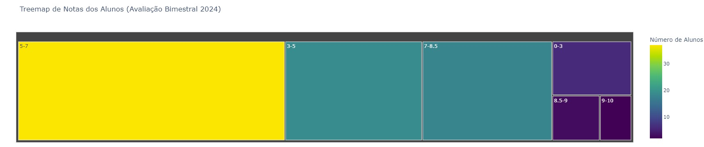

# Análise de Notas de Alunos com Estátistica descritiva e Gráficos

Este projeto tem como objetivo realizar uma análise de dados de um conjunto de notas de alunos, utilizando Python e bibliotecas como `pandas`, `seaborn` e `matplotlib`. O código permite identificar o gênero dos alunos com base nos seus nomes, além de calcular estatísticas sobre o desempenho acadêmico, como média, moda, mediana, e criar gráficos para visualização dos dados.



## Funcionalidades
- Identificação automática do gênero dos alunos com base no nome.
- Cálculo de estatísticas básicas como média, mediana e moda das notas.
- Visualização dos dados com gráficos de pizza e histogramas.
- Análise das notas.
- Identificação de alunos com notas acima ou abaixo da média.
- Detecção de outliers (valores fora do padrão) nas notas.
- Correlações de notas;

## Pré-requisitos

Antes de rodar o código, você precisará instalar as seguintes bibliotecas Python. Certifique-se de ter o Python instalado em seu sistema.

### Dependências
Para instalar as dependências necessárias, execute os seguintes comandos no terminal:

```bash
pip install pandas
pip install openpyxl
pip install seaborn
pip install matplotlib
pip install genderize
pip install gender-guesser-br
